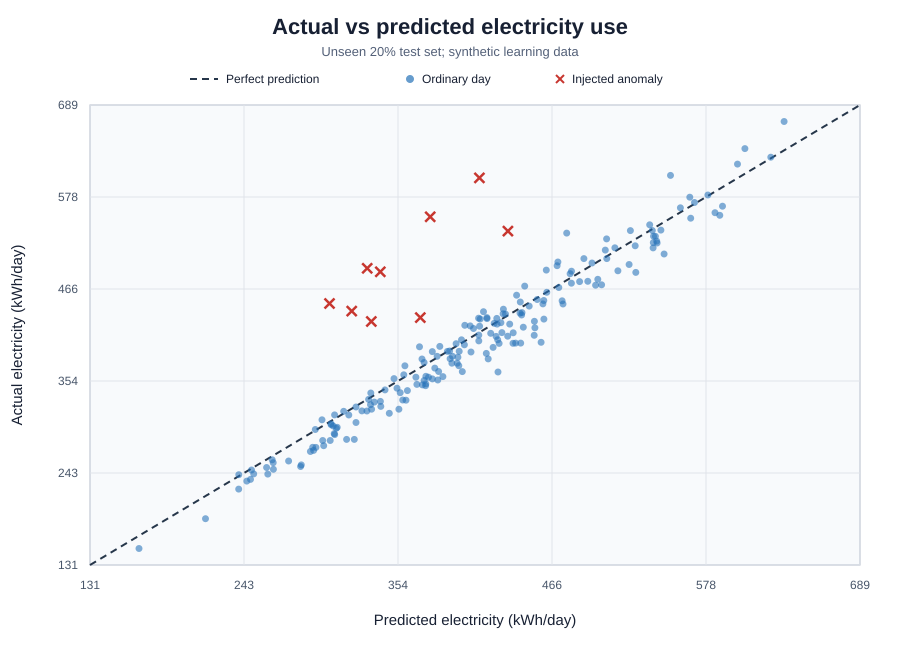
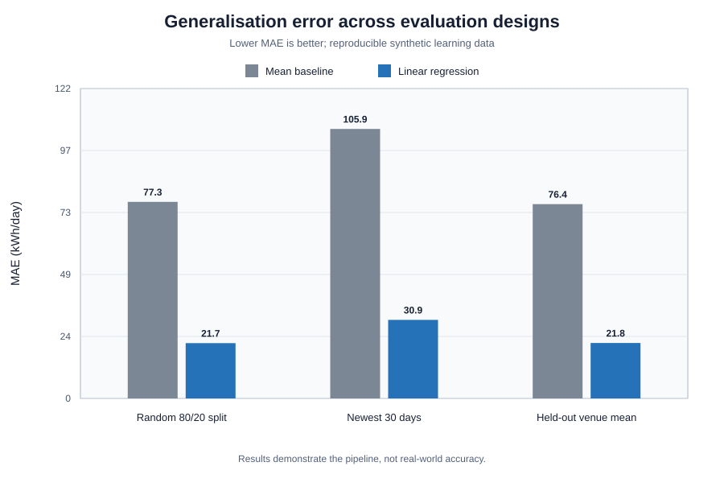
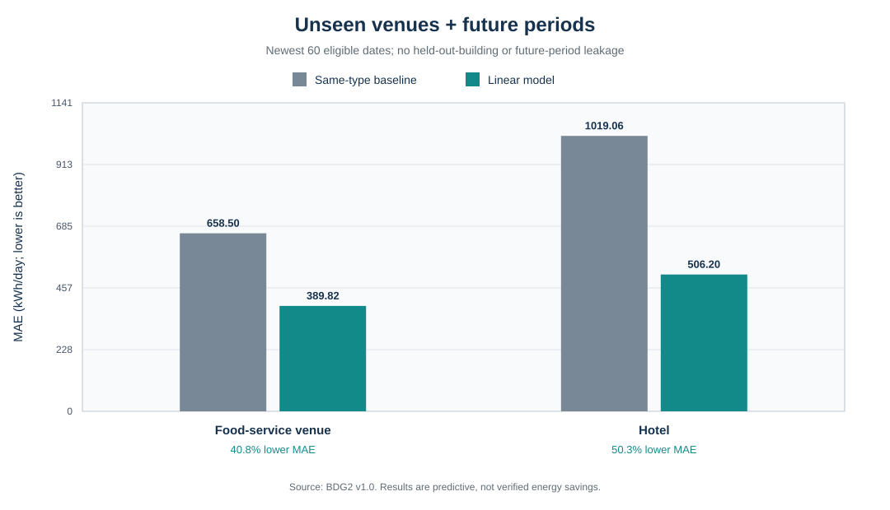
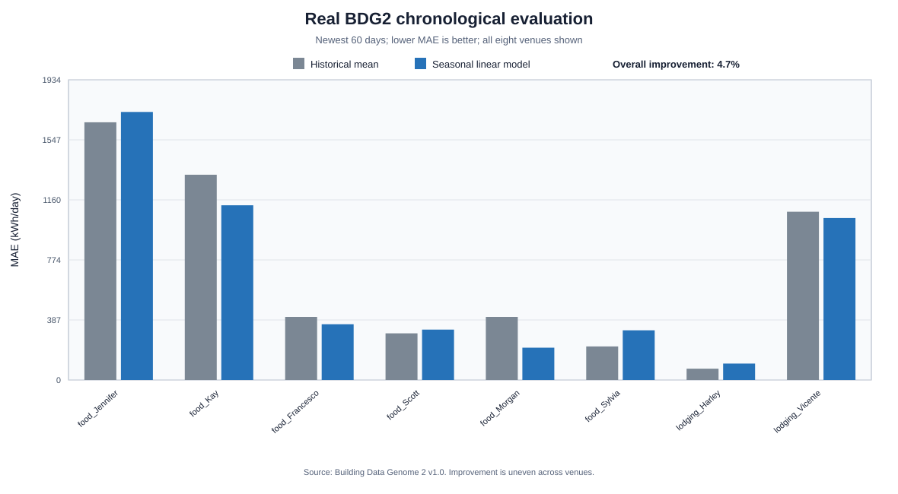

# Hospitality Sustainability AI

[](https://www.python.org/)
[](tests)
[](LICENSE)
[](#real-building-data)

An educational research prototype for predicting hospitality electricity consumption,
detecting unusual excess use and ranking practical sustainability interventions. The
project emphasises explainability, honest evaluation, data quality, privacy and human
oversight.

> **Important:** the repository reports both synthetic experiments and a first real-building
> evaluation. The real-data result measures predictive accuracy only; it is not evidence of
> causal energy savings, verified waste or successful intervention outcomes.





## Two-minute project tour

1. Read the [research question](#research-question) and the synthetic-data warning above.
2. Review the [current results](#current-results) and evaluation figure.
3. Inspect the [model card](docs/MODEL_CARD.md) for intended use, risks and safeguards.
4. Review the [frozen future-evaluation specification](docs/FROZEN_EVALUATION_SPECIFICATION.md)
   before collecting or opening new confirmation outcomes.
5. Read the [research report](docs/Hospitality_Sustainability_AI_Research_Report.pdf) for a
   concise account of the real-data method, results, limitations and next experiments.
6. Read the [real-world study protocol](docs/REAL_WORLD_STUDY_PROTOCOL.md) to see how the
   prototype could be evaluated with genuine venue data.
7. Run the test suite and experiments using the [quick-start commands](#quick-start).

The central contribution is not a claim that synthetic results will transfer directly to
real venues. It is a transparent, testable research pipeline connecting prediction,
explanation, anomaly investigation, intervention comparison and human approval.

## Research question

Can explainable machine learning use hospitality operational data to identify abnormal
resource consumption and recommend an environmentally effective, financially sensible
and operationally practical intervention for an individual venue?

## Current results

### Synthetic learning experiments

| Evaluation | Baseline MAE | Model MAE | Improvement |
|---|---:|---:|---:|
| Reproducible random 80/20 split | 77.27 kWh | 21.73 kWh | 71.9% |
| Newest 30-day chronological test | 105.93 kWh | 30.89 kWh | 70.8% |
| Mean across 20 held-out venues | 76.39 kWh | 21.80 kWh | 71.4% mean |

The held-out venue analysis reports all 20 venues rather than selecting the best result.
Current anomaly evaluation achieved 81.8% precision and 100% recall on deliberately
injected synthetic excess-use cases. These figures are not real-world claims.

### Real-building evaluation

| Evaluation on newest 60 dates | Test rows | MAE (kWh/day) |
|---|---:|---:|
| Per-venue training mean | 266 | 651.73 |
| Previous day | 266 | 159.83 |
| Seven-day rolling mean | 266 | 271.92 |
| Same weekday one week earlier | 266 | 364.68 |
| Lag-feature linear model | 266 | 159.92 |
| Seasonal linear model | 266 | 523.42 |

The real-data model improved on the original per-venue mean for four of five eligible test
venues and worsened for one, but all three leakage-safe time-series baselines were stronger
overall. Three additional source venues had no eligible test-period readings and are
explicitly reported as missing. See the [full result note](docs/REAL_DATA_RESULTS.md).

An experimental model combining the three lag features with temperature, calendar and
venue terms reached **159.92 kWh/day MAE**. This was a large improvement over the seasonal
model, but it did not beat the fixed previous-day baseline at **159.83 kWh/day**. The
near-tie is reported as a failed improvement, not rounded into a win.

### Train-only rolling validation

Four expanding 30-date folds ending before the reserved final test period compare every
candidate without reopening the held-out answers. The lag-feature model achieved the
lowest pooled validation MAE at **111.87 kWh/day**, followed by the previous-day baseline
at **134.89 kWh/day**. It led for five of eight venues, so the result is promising but not
uniform. Its later failure to beat previous day on the final period demonstrates temporal
instability rather than invalidating either result. See the
[full rolling-validation note](docs/ROLLING_VALIDATION_RESULTS.md).

The next confirmatory experiment is fixed in the
[future-evaluation specification](docs/FROZEN_EVALUATION_SPECIFICATION.md). It requires
genuinely new data and defines success as at least 5% lower pooled MAE than previous day,
plus improvement for at least half of eligible venues.

### Completely unseen-venue evaluation

Two venues were locked before evaluation using a reproducible selection rule: the venue
with the most available records in each type, with alphabetical tie-breaking. Each venue
was removed completely from its own training set. The model used venue type, floor area,
temperature, weekday and annual seasonality, but no venue identity.

| Unseen venue | Type-based baseline MAE | Model MAE | Improvement |
|---|---:|---:|---:|
| Fox_food_Francesco | 726.13 kWh/day | 327.85 kWh/day | 54.8% |
| Mouse_lodging_Vicente | 1,001.15 kWh/day | 676.23 kWh/day | 32.5% |

The predefined success criterion required improvement for both venues separately and was
met. This experiment tests transfer to new buildings, not prediction into a future time
period: training venues include records from the same dates. See the
[unseen-venue result note](docs/UNSEEN_VENUE_RESULTS.md).

### Unseen venue and future-period evaluation

The same two locked venues were then tested under a stricter design. Each model was
trained only on other venues and only on dates before the held-out venue's newest 60
eligible dates. This prevents both venue-identity leakage and future-period leakage.

| Unseen venue and future period | Type-based baseline MAE | Model MAE | Improvement |
|---|---:|---:|---:|
| Fox_food_Francesco | 658.50 kWh/day | 389.82 kWh/day | 40.8% |
| Mouse_lodging_Vicente | 1,019.06 kWh/day | 506.20 kWh/day | 50.3% |

The model beat the predefined baseline for both venues separately. The hotel's newest 60
eligible dates end on 2017-10-23 because later near-zero readings are excluded by the
existing quality rule. See the [combined evaluation result note](docs/UNSEEN_FUTURE_RESULTS.md).



## What the project includes

- Reproducible synthetic hospitality data with documented assumptions
- A mean-prediction baseline and dependency-free multivariable linear regression
- Random, chronological and leave-one-venue-out evaluation
- Residual-based anomaly alerts with precision and recall
- Exact feature-contribution explanations
- Empirical prediction ranges and low-confidence warnings
- Intervention ranking across emissions, finances and operational practicality
- Weight-sensitivity analysis that presents strong alternatives
- Anonymous staff feedback requiring multidisciplinary review
- Human approval gates, degradation monitoring and recommendation pausing
- Validated 30-minute smart-meter and daily operational-context formats
- Daily coverage, reconciliation, joining and exclusion reporting
- Venue-level data-quality reporting to expose selection bias
- Completely unseen-venue testing without venue identity as a model feature

## Quick start

Requires Python 3.10 or newer. The project uses only the Python standard library.

```bash
python -m pip install -e .
python -m unittest discover -s tests -v
```

Generate data and run the core evaluations:

```bash
python -m hospitality_ai.synthetic_data --rows 1000 --seed 2026
python -m hospitality_ai.baseline --rows 1000 --seed 2026
python -m hospitality_ai.linear_model --rows 1000 --seed 2026
python -m hospitality_ai.temporal_validation --rows 365 --test-days 30
python -m hospitality_ai.venue_validation --rows 2000 --all-venues
python -m hospitality_ai.anomaly --rows 1000 --seed 2026
python -m hospitality_ai.uncertainty --rows 1000 --seed 2026
python -m hospitality_ai.evaluation_chart
python -m hospitality_ai.generalisation_chart
python -m hospitality_ai.unseen_venue_evaluation
python -m hospitality_ai.unseen_future_evaluation
python -m hospitality_ai.rolling_validation
```

Explain an alert and compare feasible interventions:

```bash
python -m hospitality_ai.explain --rows 1000 --seed 2026
python -m hospitality_ai.recommend --predicted-daily-kwh 416.05 --budget-gbp 1500
python -m hospitality_ai.decision_sensitivity --step 0.05
```

## Synthetic learning data

The daily regression target is `electricity_kwh`. Model features include venue type,
customers, opening hours, temperature distance from 18 C, floor area, kitchen-equipment
count and day of week. `venue_id` is only a pseudonymous identifier. The injected anomaly
label is used only after prediction for evaluation and never as an input feature.

Synthetic electricity is generated from a visible equation plus random variation and
occasional artificial excess use. A fixed seed makes experiments reproducible. Because
the generator defines the relationships, strong results are expected and cannot establish
external validity.

## Real building data

The project now includes a reproducible importer for the open [Building Data Genome 2
dataset](https://doi.org/10.5281/zenodo.3887306). From the official metadata it selects
six buildings whose primary use is `Food sales and service` and two lodging buildings
whose subindustry is explicitly `Hotel`. Hourly electricity readings are aggregated to
daily totals only when at least 20 hourly values are present, and daily mean outdoor
temperature is joined by site and date.

The generated file, `data/processed/bdg2_hospitality_daily.csv`, contains 5,755 daily
records covering 2016-01-01 to 2017-12-31. It includes venue ID, date, venue type, floor
area, outdoor temperature, observed-hour count and electricity use. The large source files
are excluded from Git; reproduce the subset after downloading and extracting BDG2 v1.0:

```bash
python -m hospitality_ai.bdg2_real_data PATH_TO_EXTRACTED_BDG2 \
  --output data/processed/bdg2_hospitality_daily.csv
```

BDG2 does not provide restaurant customer counts, opening hours or kitchen-equipment
counts. Therefore this subset supports real building-energy validation, not full validation
of the operational hospitality model. Dataset provenance and licensing are recorded in
[`docs/DATA_SOURCES.md`](docs/DATA_SOURCES.md).

### First real-data evaluation

A chronological experiment trained on eligible records through 2017-11-01 and tested on
the newest 60 dates. After applying a fixed pre-split rule that excludes zero/near-zero
meter states, the seasonal linear model achieved **523.42 kWh/day MAE**, compared with
**651.73 kWh/day** for a per-venue historical-mean baseline: a **19.7% overall
improvement**. Performance improved for four of five eligible test venues and worsened for
one. Three other source venues had no eligible test-period readings and are reported as
missing rather than scored.

Stronger rolling-origin comparisons now show **159.83 kWh/day** for the previous-day
baseline, **271.92 kWh/day** for the seven-day rolling mean, and **364.68 kWh/day** for the
same weekday one week earlier. These baselines predict each date before observing it and
only then add its actual values to history. This honest comparison shows the current model
does not beat simple recent-history forecasts.

The follow-up lag-feature model used those same leakage-safe recent-history values as
inputs alongside weather and calendar features. It achieved **159.92 kWh/day MAE**, which
is **0.09 kWh/day worse** than the previous-day baseline. No post-test tuning was performed.



Full method, results and interpretation: [real-data evaluation](docs/REAL_DATA_RESULTS.md).

## Evaluation design

- **Baseline:** training-set mean predicted for every test record.
- **Primary error metric:** mean absolute error (MAE); lower is better.
- **Random split:** initial reproducible 80/20 software experiment.
- **Chronological split:** train on the past and reserve the newest month.
- **Time-series baselines:** in chronological real-data evaluation, predict from strictly
  earlier observations; update history only after each test date is predicted.
- **Venue validation:** exclude each venue completely, report every result, and summarise
  mean, best and worst performance.
- **Anomaly evaluation:** calculate precision and recall against injected labels.

An alert is evidence for investigation, not proof of waste. High consumption can reflect
a special event, missing feature, sensor problem or genuine operational change.

## Explainability, uncertainty and recommendations

For linear regression, every explanation is `input value x learned coefficient`, and the
contributions sum exactly to the prediction. This describes model association, not
real-world causation.

Prediction ranges use the robust spread of training residuals. Low confidence is reported
for insufficient training data or inputs outside represented ranges. The range is a
model-based estimate, not a guarantee or a calibrated real-world coverage claim.

Interventions are ranked using editable weights for emissions, financial benefit and
practicality. Prices, reduction rates, emissions factors and practicality values are
illustrative. Weight sensitivity reports how often each option wins so the leading result
is presented with alternatives rather than as an objective truth.

## Proposed real-world data workflow

The detailed design is in the [real-world study protocol](docs/REAL_WORLD_STUDY_PROTOCOL.md).
It proposes one year of calibrated 30-minute smart-meter readings, verified daily totals,
pseudonymous venue IDs, separate venue permission and voluntary staff consent.

Data templates:

- [30-minute smart-meter readings](data/templates/smart_meter_readings.csv)
- [Daily operational context](data/templates/daily_operational_context.csv)

Meter quality is labelled `verified`, `estimated`, `missing` or `fault`. Primary evaluation
uses only verified readings; estimated values may appear in a separately labelled
sensitivity analysis. A UTC day expects 48 half-hour intervals. Partial days are retained
as incomplete with their coverage percentage and are never described as full daily totals.

Complete interval sums are compared with independently verified daily totals using an
illustrative 1% rounding tolerance. Mismatches are investigated, never silently corrected.
Meter and operational records join only on `venue_id` and `utc_date`; unmatched records and
all exclusion reasons are reported overall and by venue.

## Privacy and governance

- No employee, customer, event-client or wedding-couple names are required.
- Business names and full addresses stay outside model-training files.
- Anonymous feedback cannot enter training without approval from operations,
  sustainability and research reviewers.
- Candidate models must improve overall MAE without worsening the poorest venue result.
- Deployment requires authorised human approval and retains the previous model for rollback.
- Material performance degradation pauses recommendations and triggers human review.
- Verified meter readings and AI recommendation status are controlled separately.
- Important state changes require an append-only audit trail and approved retention schedule.

The protocol must receive institutional ethics and data-protection approval before any
real participants are recruited or monitoring equipment is installed.

For a structured account of intended use, evaluation boundaries, foreseeable risks and
release criteria, see the [model card](docs/MODEL_CARD.md).

## Repository structure

```text
data/templates/       Example real-data formats
docs/                 Model card and proposed study protocol
figures/              Reproducible evaluation chart
src/hospitality_ai/   Modelling, validation and governance modules
tests/                Automated unit tests
```

## Limitations

- No first-party venue data or verified intervention outcomes have been collected.
- The BDG2 subset is real non-residential building data, but it was collected by third
  parties and lacks several hospitality operational variables.
- The linear model is intentionally interpretable and may not capture complex real patterns.
- Synthetic observations do not reproduce every venue, behaviour, season or sensor failure.
- Prediction ranges are empirical demonstrations, not formal calibrated intervals.
- Intervention assumptions require current, location-specific evidence before use.
- The prototype is decision support, not an autonomous enforcement or compliance system.

## Author and licence

Developed by **Akshith Moharampudi** as a learning and research portfolio project.
Released under the MIT License. See [LICENSE](LICENSE).
